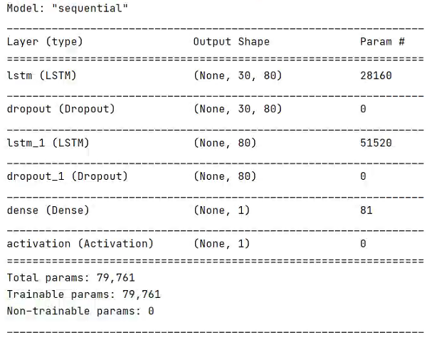
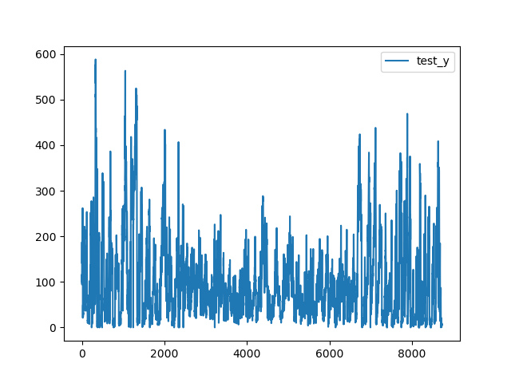
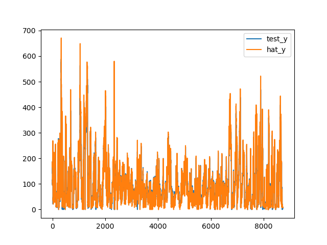

This project provide a simple but efficient way for multi-demensional time series forecasting by using LSTM.
Additionally, it also provide an out-of-box way about modeling,forecasting and evaluating(RMSE,MAE,MAPE).

Keras Version: 2.4.3 

Tensorflow-GPU Version: 2.3.0

---
Layers

---

Result

