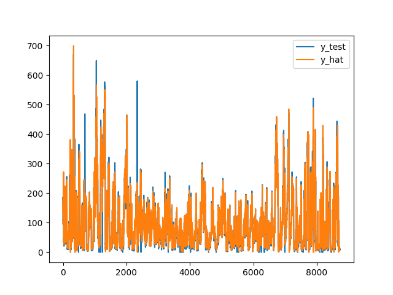

This project provide a simple and forecasting way for multi-demensional time series prediction by using LSTM.
Additionally, it also provide an out-of-box way about modeling,forecasting and evaluating(RMSE,MAE,MAPE).

This project also include a grid search script so you can find suitable params for the model.But this script may have some little errors (like spelling mistakes),so be careful when use it.

Keras Version: 2.2 

Tensorflow Version: 1.13.1

---
Result

